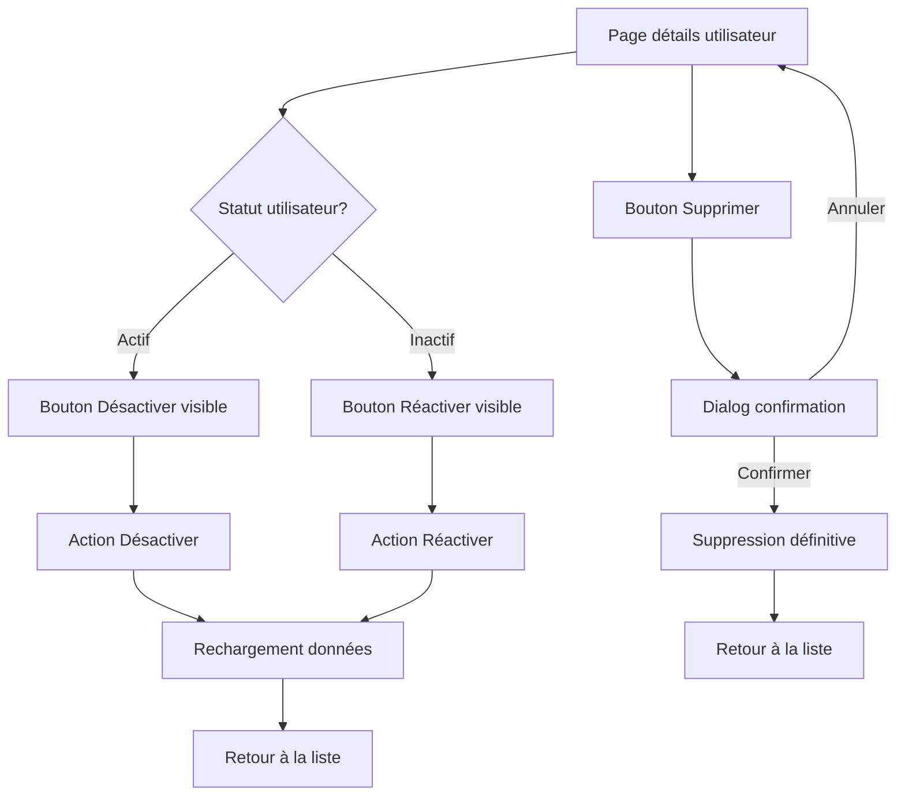

# 🔧 Actions Administrateur - Documentation

## 📋 Vue d'ensemble

Cette mise à jour ajoute des fonctionnalités d'administration avancées permettant aux administrateurs de gérer les comptes utilisateurs : désactiver, réactiver et supprimer des utilisateurs.

## 🚀 Fonctionnalités ajoutées

### **Actions disponibles**

1. **Désactiver un utilisateur** (`POST /auth/disable-user/{user_id}`)
   - ✅ Change `is_active = false`
   - ✅ L'utilisateur ne peut plus se connecter
   - ✅ Réversible avec "Réactiver"

2. **Réactiver un utilisateur** (`POST /auth/enable-user/{user_id}`)
   - ✅ Change `is_active = true`
   - ✅ L'utilisateur peut à nouveau se connecter
   - ✅ Disponible pour les comptes désactivés

3. **Supprimer un utilisateur** (`DELETE /auth/delete-user/{user_id}`)
   - ✅ Suppression définitive de la base de données
   - ✅ **Action irréversible**
   - ✅ Confirmation obligatoire

## 🏗️ Implémentation

### **AdminService** (`src/services/adminService.ts`)

#### **Nouvelles méthodes ajoutées**

```typescript
// Désactiver un utilisateur
static async disableUser(userId: number): Promise<{ success: boolean; message: string }>

// Réactiver un utilisateur  
static async enableUser(userId: number): Promise<{ success: boolean; message: string }>

// Supprimer un utilisateur
static async deleteUser(userId: number): Promise<{ success: boolean; message: string }>
```

#### **Sécurité intégrée**
- ✅ Vérification des privilèges admin automatique
- ✅ Authentification par cookies
- ✅ Gestion des erreurs 401/403

### **UserDetails** (`src/components/admin/UserDetails.tsx`)

#### **Interface utilisateur**

```typescript
// Nouvelle section "Actions administrateur"
- Bouton "Désactiver" (si utilisateur actif)
- Bouton "Réactiver" (si utilisateur inactif)  
- Bouton "Supprimer" (toujours disponible)
- États de chargement pendant les actions
- Messages de confirmation
```

#### **Fonctionnalités UX**

- ✅ **Boutons conditionnels** : Désactiver/Réactiver selon le statut
- ✅ **États de chargement** : Boutons désactivés pendant les actions
- ✅ **Notifications toast** : Succès/erreur avec messages explicites
- ✅ **Confirmation suppression** : Dialog de confirmation obligatoire
- ✅ **Rechargement automatique** : Données mises à jour après action
- ✅ **Navigation intelligente** : Retour à la liste après suppression

## 🎨 Interface utilisateur

### **Section "Actions administrateur"**

```
┌─────────────────────────────────────────┐
│ 🛡️ Actions administrateur              │
├─────────────────────────────────────────┤
│ [Désactiver] [Supprimer]                │
│                                         │
│ • Désactiver/Réactiver : Change le     │
│   statut actif de l'utilisateur        │
│ • Supprimer : Supprime définitivement  │
│   l'utilisateur (irréversible)         │
└─────────────────────────────────────────┘
```

### **États des boutons**

- **Utilisateur actif** : `[Désactiver] [Supprimer]`
- **Utilisateur inactif** : `[Réactiver] [Supprimer]`
- **Pendant action** : Boutons désactivés avec spinner
- **Après suppression** : Retour automatique à la liste

## 🔒 Sécurité

### **Vérifications automatiques**

1. **Privilèges admin** : Vérifiés avant chaque action
2. **Authentification** : Cookies JWT requis
3. **Autorisation** : Seuls les admins peuvent effectuer ces actions
4. **Confirmation** : Dialog obligatoire pour la suppression

### **Gestion des erreurs**

- **401** : Authentification requise
- **403** : Privilèges administrateur requis
- **404** : Utilisateur non trouvé
- **500** : Erreur serveur

## 🚀 Utilisation

### **Pour les administrateurs**

1. **Accéder aux détails utilisateur** : Cliquer sur un utilisateur dans la liste
2. **Désactiver un compte** : Bouton "Désactiver" → Confirmation → Compte désactivé
3. **Réactiver un compte** : Bouton "Réactiver" → Confirmation → Compte réactivé
4. **Supprimer un compte** : Bouton "Supprimer" → Dialog de confirmation → Suppression définitive

### **Flux d'actions**



## 📁 Fichiers modifiés

### **Services**
- `src/services/adminService.ts` - **3 nouvelles méthodes ajoutées**

### **Composants**
- `src/components/admin/UserDetails.tsx` - **Section actions ajoutée**

## ✅ Tests recommandés

### **Tests fonctionnels**

1. **Désactivation** : Vérifier que l'utilisateur devient inactif
2. **Réactivation** : Vérifier que l'utilisateur redevient actif
3. **Suppression** : Vérifier la suppression définitive
4. **Confirmation** : Vérifier le dialog de confirmation
5. **Navigation** : Vérifier le retour à la liste après suppression

### **Tests de sécurité**

1. **Non-admin** : Vérifier que les actions ne sont pas accessibles
2. **Authentification** : Vérifier les erreurs 401/403
3. **Autorisation** : Vérifier que seuls les admins peuvent agir

## 🎯 Prochaines améliorations

- [ ] **Historique des actions** : Log des modifications admin
- [ ] **Actions en lot** : Sélection multiple d'utilisateurs
- [ ] **Notifications** : Alertes par email aux utilisateurs
- [ ] **Audit trail** : Traçabilité complète des actions
- [ ] **Restauration** : Récupération des comptes supprimés

## 🎉 Résultat final

Les administrateurs disposent maintenant d'un **contrôle total** sur les comptes utilisateurs :

- ✅ **Gestion des statuts** : Activer/désactiver facilement
- ✅ **Suppression définitive** : Nettoyage de la base de données
- ✅ **Interface intuitive** : Actions claires et sécurisées
- ✅ **Feedback utilisateur** : Notifications et confirmations
- ✅ **Sécurité renforcée** : Vérifications automatiques

L'interface d'administration est maintenant **complète et professionnelle** ! 🚀
